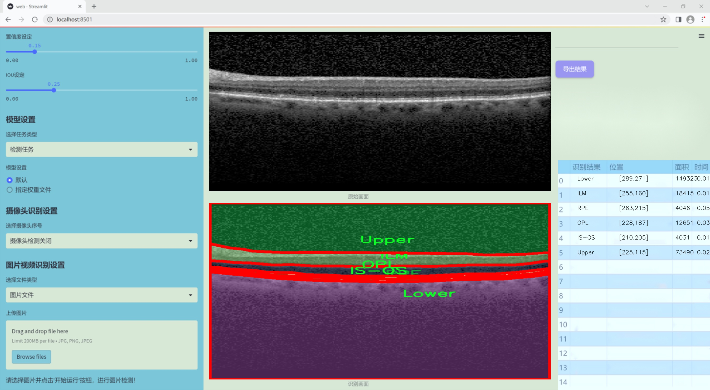
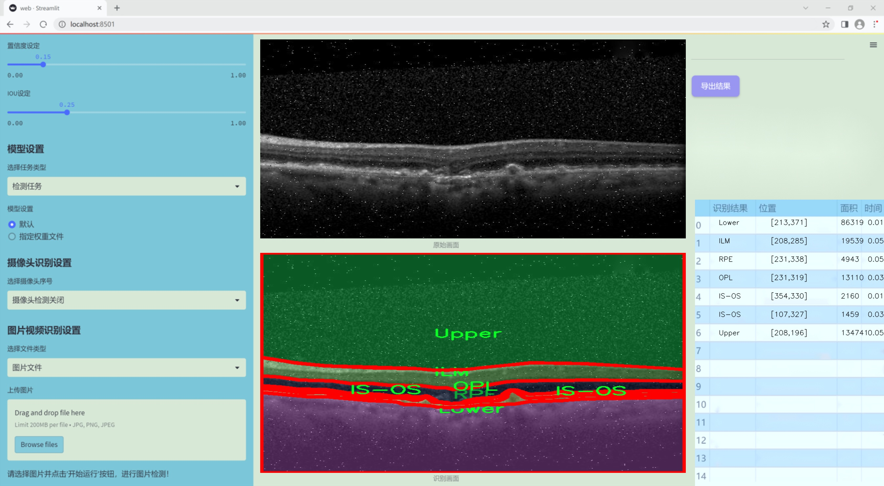
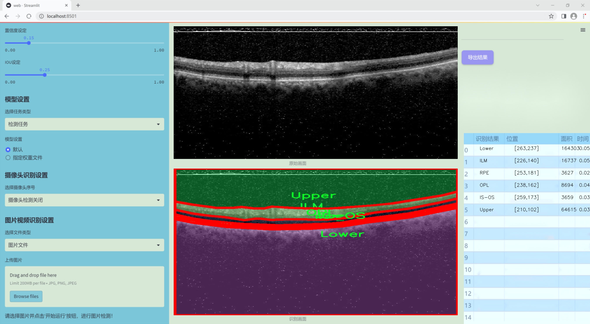
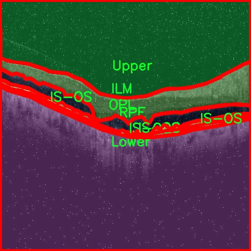
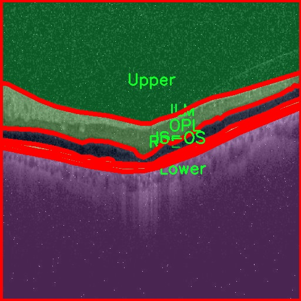
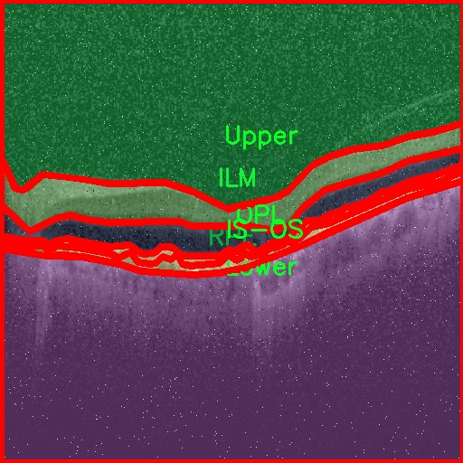
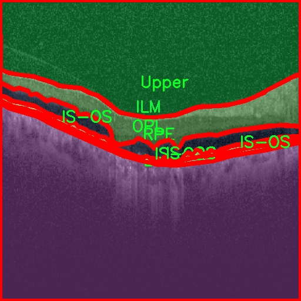
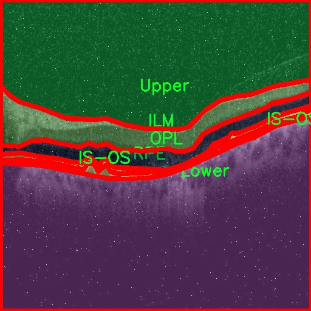

### 1.背景意义

研究背景与意义

眼底图像分析在医学影像学中扮演着至关重要的角色，尤其是在早期诊断和监测眼科疾病方面。随着人口老龄化的加剧，眼科疾病的发病率逐年上升，尤其是糖尿病视网膜病变、黄斑变性等疾病，给患者的视力健康带来了严重威胁。因此，开发高效、准确的眼底图像分析系统，尤其是层次分割技术，显得尤为重要。层次分割能够帮助医生清晰地识别和定位眼底图像中的各个结构，进而提高诊断的准确性和效率。

本研究旨在基于改进的YOLOv11模型，构建一个高效的眼底图像层次分割系统。该系统将利用oct5k_new_new数据集，该数据集包含4600幅眼底图像，涵盖了6个不同的类别，包括内界膜（ILM）、视网膜色素上皮（RPE）、外层（OPL）等。这些类别的准确分割对于疾病的诊断和治疗方案的制定至关重要。通过对这些图像进行深度学习训练，系统将能够自动识别和分割出眼底图像中的关键结构，减轻医生的工作负担，提高诊断效率。

此外，数据集经过多种数据增强处理，极大地丰富了训练样本的多样性，提升了模型的泛化能力。这种方法不仅可以提高模型在实际应用中的表现，还能为后续的研究提供坚实的数据基础。随着深度学习技术的不断进步，基于YOLOv11的眼底图像层次分割系统将为眼科医学提供新的解决方案，推动眼底疾病的早期诊断和治疗进程，具有重要的临床应用价值和社会意义。

### 2.视频效果

[2.1 视频效果](https://www.bilibili.com/video/BV1bPkFYbEtR/)

### 3.图片效果







##### [项目涉及的源码数据来源链接](https://kdocs.cn/l/cszuIiCKVNis)**

注意：本项目提供训练的数据集和训练教程,由于版本持续更新,暂不提供权重文件（best.pt）,请按照6.训练教程进行训练后实现上图演示的效果。

### 4.数据集信息

##### 4.1 本项目数据集类别数＆类别名

nc: 6
names: ['ILM', 'IS-OS', 'Lower', 'OPL', 'RPE', 'Upper']


该项目为【图像分割】数据集，请在【训练教程和Web端加载模型教程（第三步）】这一步的时候按照【图像分割】部分的教程来训练

##### 4.2 本项目数据集信息介绍

本项目数据集信息介绍

本项目所使用的数据集名为“oct5k_new_new”，旨在为改进YOLOv11的眼底图像层次分割系统提供高质量的训练数据。该数据集专注于眼底图像的分割任务，包含了六个主要类别，分别为内界膜（ILM）、光感受器层与视网膜色素上皮层（IS-OS）、下层（Lower）、外核层（OPL）、视网膜色素上皮层（RPE）以及上层（Upper）。这些类别涵盖了眼底图像中重要的解剖结构，对于眼科疾病的诊断和治疗具有重要意义。

在数据集的构建过程中，所有图像均经过精心标注，以确保每个类别的分割边界清晰且准确。这种高质量的标注不仅提高了模型训练的有效性，也为后续的验证和测试提供了可靠的基础。数据集中的图像样本来自多种不同的眼底扫描，涵盖了不同年龄段和病理状态的患者，从而增强了模型的泛化能力和适应性。

此外，数据集的多样性使得模型能够学习到不同解剖结构在不同条件下的表现，进一步提升了分割精度。通过使用“oct5k_new_new”数据集，研究人员希望能够推动眼底图像分析技术的发展，尤其是在自动化分割和疾病检测方面的应用。最终目标是实现更为精准的眼底图像分析，以辅助临床医生进行早期诊断和个性化治疗方案的制定。数据集的设计和实施为本项目的成功奠定了坚实的基础，期待通过这一研究为眼科领域带来新的突破。











### 5.全套项目环境部署视频教程（零基础手把手教学）

[5.1 所需软件PyCharm和Anaconda安装教程（第一步）](https://www.bilibili.com/video/BV1BoC1YCEKi/?spm_id_from=333.999.0.0&vd_source=bc9aec86d164b67a7004b996143742dc)


[5.2 安装Python虚拟环境创建和依赖库安装视频教程（第二步）](https://www.bilibili.com/video/BV1ZoC1YCEBw?spm_id_from=333.788.videopod.sections&vd_source=bc9aec86d164b67a7004b996143742dc)

### 6.改进YOLOv11训练教程和Web_UI前端加载模型教程（零基础手把手教学）

[6.1 改进YOLOv11训练教程和Web_UI前端加载模型教程（第三步）](https://www.bilibili.com/video/BV1BoC1YCEhR?spm_id_from=333.788.videopod.sections&vd_source=bc9aec86d164b67a7004b996143742dc)


按照上面的训练视频教程链接加载项目提供的数据集，运行train.py即可开始训练



     Epoch   gpu_mem       box       obj       cls    labels  img_size
     1/200     20.8G   0.01576   0.01955  0.007536        22      1280: 100%|██████████| 849/849 [14:42<00:00,  1.04s/it]
               Class     Images     Labels          P          R     mAP@.5 mAP@.5:.95: 100%|██████████| 213/213 [01:14<00:00,  2.87it/s]
                 all       3395      17314      0.994      0.957      0.0957      0.0843

     Epoch   gpu_mem       box       obj       cls    labels  img_size
     2/200     20.8G   0.01578   0.01923  0.007006        22      1280: 100%|██████████| 849/849 [14:44<00:00,  1.04s/it]
               Class     Images     Labels          P          R     mAP@.5 mAP@.5:.95: 100%|██████████| 213/213 [01:12<00:00,  2.95it/s]
                 all       3395      17314      0.996      0.956      0.0957      0.0845

     Epoch   gpu_mem       box       obj       cls    labels  img_size
     3/200     20.8G   0.01561    0.0191  0.006895        27      1280: 100%|██████████| 849/849 [10:56<00:00,  1.29it/s]
               Class     Images     Labels          P          R     mAP@.5 mAP@.5:.95: 100%|███████   | 187/213 [00:52<00:00,  4.04it/s]
                 all       3395      17314      0.996      0.957      0.0957      0.0845


###### [项目数据集下载链接](https://kdocs.cn/l/cszuIiCKVNis)

### 7.原始YOLOv11算法讲解

YOLOv11是Ultralytics推出的YOLO系列最新版本，专为实现尖端的物体检测而设计。其架构和训练方法上进行了重大改进，使之不仅具备卓越的准确性和处理速度，还在计算效率上实现了一场革命。得益于其改进的主干和颈部架构，YOLOv11在特征提取和处理复杂任务时表现更加出色。在2024年9月27日，Ultralytics通过长达九小时的在线直播发布这一新作，展示了其在计算机视觉领域的革新。

YOLOv11通过精细的架构设计和优化训练流程，在保持高精度的同时，缩减了参数量，与YOLOv8m相比减少了22%的参数，使其在COCO数据集上的平均准确度（mAP）有所提升。这种效率的提高使YOLOv11非常适合部署在各种硬件环境中，包括边缘设备、云计算平台以及支持NVIDIA GPU的系统，确保在灵活性上的优势。

该模型支持广泛的任务，从对象检测、实例分割到图像分类、姿态估计和定向对象检测（OBB），几乎覆盖了计算机视觉的所有主要挑战。其创新的C3k2和C2PSA模块提升了网络深度和注意力机制的应用，提高了特征提取的效率和效果。同时，YOLOv11的改进网络结构也使之在复杂视觉任务上得以从容应对，成为各类计算机视觉任务的多功能选择。这些特性令YOLOv11在实施实时物体检测的各个领域中表现出众。
* * *

2024年9月27日，Ultralytics在线直播长达九小时，为YOLO11召开“发布会”

YOLO11 是 Ultralytics YOLO 系列实时物体检测器的最新版本，它以尖端的准确性、速度和效率重新定义了可能性。在之前 YOLO
版本的显著进步的基础上，YOLO11 在架构和训练方法方面进行了重大改进，使其成为各种计算机视觉任务的多功能选择。


##### YOLO11主要特点：

  * 增强的特征提取：YOLO11 采用了改进的主干和颈部架构，增强了特征提取能力，可实现更精确的对象检测和复杂任务性能。
  * 针对效率和速度进行了优化：YOLO11 引入了完善的架构设计和优化的训练流程，可提供更快的处理速度，并在准确度和性能之间保持最佳平衡。
  * 更少的参数，更高的准确度：借助模型设计的进步，YOLO11m 在 COCO 数据集上实现了更高的平均准确度 (mAP)，同时使用的参数比 YOLOv8m 少 22%，从而提高了计算效率，同时又不影响准确度。
  * 跨环境的适应性：YOLO11 可以无缝部署在各种环境中，包括边缘设备、云平台和支持 NVIDIA GPU 的系统，从而确保最大的灵活性。
  * 支持的任务范围广泛：无论是对象检测、实例分割、图像分类、姿势估计还是定向对象检测 (OBB)，YOLO11 都旨在满足各种计算机视觉挑战。

##### 支持的任务和模式

YOLO11 以 YOLOv8 中引入的多功能模型系列为基础，为各种计算机视觉任务提供增强的支持：

Model| Filenames| Task| Inference| Validation| Training| Export  
---|---|---|---|---|---|---  
YOLO11| yolol11n.pt, yolol11s.pt, yolol11m.pt, yolol11x.pt| Detection| ✅| ✅|
✅| ✅  
YOLO11-seg| yolol11n-seg.pt, yolol11s-seg.pt, yolol11m-seg.pt,
yolol11x-seg.pt| Instance Segmentation| ✅| ✅| ✅| ✅  
YOLO11-pose| yolol11n-pose.pt, yolol11s-pose.pt, yolol11m-pose.pt,
yolol11x-pose.pt| Pose/Keypoints| ✅| ✅| ✅| ✅  
YOLO11-obb| yolol11n-obb.pt, yolol11s-obb.pt, yolol11m-obb.pt,
yolol11x-obb.pt| Oriented Detection| ✅| ✅| ✅| ✅  
YOLO11-cls| yolol11n-cls.pt, yolol11s-cls.pt, yolol11m-cls.pt,
yolol11x-cls.pt| Classification| ✅| ✅| ✅| ✅  
  
##### 简单的 YOLO11 训练和推理示例

以下示例适用于用于对象检测的 YOLO11 Detect 模型。

    
    
    from ultralytics import YOLO
    
    # Load a model
    model = YOLO("yolo11n.pt")
    
    # Train the model
    train_results = model.train(
        data="coco8.yaml",  # path to dataset YAML
        epochs=100,  # number of training epochs
        imgsz=640,  # training image size
        device="cpu",  # device to run on, i.e. device=0 or device=0,1,2,3 or device=cpu
    )
    
    # Evaluate model performance on the validation set
    metrics = model.val()
    
    # Perform object detection on an image
    results = model("path/to/image.jpg")
    results[0].show()
    
    # Export the model to ONNX format
    path = model.export(format="onnx")  # return path to exported model

##### 支持部署于边缘设备

YOLO11 专为适应各种环境而设计，包括边缘设备。其优化的架构和高效的处理能力使其适合部署在边缘设备、云平台和支持 NVIDIA GPU
的系统上。这种灵活性确保 YOLO11 可用于各种应用，从移动设备上的实时检测到云环境中的复杂分割任务。有关部署选项的更多详细信息，请参阅导出文档。

##### YOLOv11 yaml文件

    
    
    # Ultralytics YOLO 🚀, AGPL-3.0 license
    # YOLO11 object detection model with P3-P5 outputs. For Usage examples see https://docs.ultralytics.com/tasks/detect
    
    # Parameters
    nc: 80 # number of classes
    scales: # model compound scaling constants, i.e. 'model=yolo11n.yaml' will call yolo11.yaml with scale 'n'
      # [depth, width, max_channels]
      n: [0.50, 0.25, 1024] # summary: 319 layers, 2624080 parameters, 2624064 gradients, 6.6 GFLOPs
      s: [0.50, 0.50, 1024] # summary: 319 layers, 9458752 parameters, 9458736 gradients, 21.7 GFLOPs
      m: [0.50, 1.00, 512] # summary: 409 layers, 20114688 parameters, 20114672 gradients, 68.5 GFLOPs
      l: [1.00, 1.00, 512] # summary: 631 layers, 25372160 parameters, 25372144 gradients, 87.6 GFLOPs
      x: [1.00, 1.50, 512] # summary: 631 layers, 56966176 parameters, 56966160 gradients, 196.0 GFLOPs
    
    # YOLO11n backbone
    backbone:
      # [from, repeats, module, args]
      - [-1, 1, Conv, [64, 3, 2]] # 0-P1/2
      - [-1, 1, Conv, [128, 3, 2]] # 1-P2/4
      - [-1, 2, C3k2, [256, False, 0.25]]
      - [-1, 1, Conv, [256, 3, 2]] # 3-P3/8
      - [-1, 2, C3k2, [512, False, 0.25]]
      - [-1, 1, Conv, [512, 3, 2]] # 5-P4/16
      - [-1, 2, C3k2, [512, True]]
      - [-1, 1, Conv, [1024, 3, 2]] # 7-P5/32
      - [-1, 2, C3k2, [1024, True]]
      - [-1, 1, SPPF, [1024, 5]] # 9
      - [-1, 2, C2PSA, [1024]] # 10
    
    # YOLO11n head
    head:
      - [-1, 1, nn.Upsample, [None, 2, "nearest"]]
      - [[-1, 6], 1, Concat, [1]] # cat backbone P4
      - [-1, 2, C3k2, [512, False]] # 13
    
      - [-1, 1, nn.Upsample, [None, 2, "nearest"]]
      - [[-1, 4], 1, Concat, [1]] # cat backbone P3
      - [-1, 2, C3k2, [256, False]] # 16 (P3/8-small)
    
      - [-1, 1, Conv, [256, 3, 2]]
      - [[-1, 13], 1, Concat, [1]] # cat head P4
      - [-1, 2, C3k2, [512, False]] # 19 (P4/16-medium)
    
      - [-1, 1, Conv, [512, 3, 2]]
      - [[-1, 10], 1, Concat, [1]] # cat head P5
      - [-1, 2, C3k2, [1024, True]] # 22 (P5/32-large)
    
      - [[16, 19, 22], 1, Detect, [nc]] # Detect(P3, P4, P5)
    

**YOLO11和YOLOv8 yaml文件的区别**


##### 改进模块代码

  * C3k2 

    
    
    class C3k2(C2f):
        """Faster Implementation of CSP Bottleneck with 2 convolutions."""
    
        def __init__(self, c1, c2, n=1, c3k=False, e=0.5, g=1, shortcut=True):
            """Initializes the C3k2 module, a faster CSP Bottleneck with 2 convolutions and optional C3k blocks."""
            super().__init__(c1, c2, n, shortcut, g, e)
            self.m = nn.ModuleList(
                C3k(self.c, self.c, 2, shortcut, g) if c3k else Bottleneck(self.c, self.c, shortcut, g) for _ in range(n)
            )

C3k2，它是具有两个卷积的CSP（Partial Cross Stage）瓶颈架构的更快实现。

**类继承：**

  * `C3k2`继承自类`C2f`。这表明`C2f`很可能实现了经过修改的基本CSP结构，而`C3k2`进一步优化或修改了此结构。

**构造函数（`__init__`）：**

  * `c1`：输入通道。

  * `c2`：输出通道。

  * `n`：瓶颈层数（默认为1）。

  * `c3k`：一个布尔标志，确定是否使用`C3k`块或常规`Bottleneck`块。

  * `e`：扩展比率，控制隐藏层的宽度（默认为0.5）。

  * `g`：分组卷积的组归一化参数或组数（默认值为 1）。

  * `shortcut`：一个布尔值，用于确定是否在网络中包含快捷方式连接（默认值为 `True`）。

**初始化：**

  * `super().__init__(c1, c2, n, short-cut, g, e)` 调用父类 `C2f` 的构造函数，初始化标准 CSP 组件，如通道数、快捷方式、组等。

**模块列表（`self.m`）：**

  * `nn.ModuleList` 存储 `C3k` 或 `Bottleneck` 模块，具体取决于 `c3k` 的值。

  * 如果 `c3k` 为 `True`，它会初始化 `C3k` 模块。`C3k` 模块接收以下参数：

  * `self.c`：通道数（源自 `C2f`）。

  * `2`：这表示在 `C3k` 块内使用了两个卷积层。

  * `shortcut` 和 `g`：从 `C3k2` 构造函数传递。

  * 如果 `c3k` 为 `False`，则初始化标准 `Bottleneck` 模块。

`for _ in range(n)` 表示将创建 `n` 个这样的块。

**总结：**

  * `C3k2` 实现了 CSP 瓶颈架构，可以选择使用自定义 `C3k` 块（具有两个卷积）或标准 `Bottleneck` 块，具体取决于 `c3k` 标志。

  * C2PSA

    
    
    class C2PSA(nn.Module):
        """
        C2PSA module with attention mechanism for enhanced feature extraction and processing.
    
        This module implements a convolutional block with attention mechanisms to enhance feature extraction and processing
        capabilities. It includes a series of PSABlock modules for self-attention and feed-forward operations.
    
        Attributes:
            c (int): Number of hidden channels.
            cv1 (Conv): 1x1 convolution layer to reduce the number of input channels to 2*c.
            cv2 (Conv): 1x1 convolution layer to reduce the number of output channels to c.
            m (nn.Sequential): Sequential container of PSABlock modules for attention and feed-forward operations.
    
        Methods:
            forward: Performs a forward pass through the C2PSA module, applying attention and feed-forward operations.
    
        Notes:
            This module essentially is the same as PSA module, but refactored to allow stacking more PSABlock modules.
    
        Examples:
            >>> c2psa = C2PSA(c1=256, c2=256, n=3, e=0.5)
            >>> input_tensor = torch.randn(1, 256, 64, 64)
            >>> output_tensor = c2psa(input_tensor)
        """
    
        def __init__(self, c1, c2, n=1, e=0.5):
            """Initializes the C2PSA module with specified input/output channels, number of layers, and expansion ratio."""
            super().__init__()
            assert c1 == c2
            self.c = int(c1 * e)
            self.cv1 = Conv(c1, 2 * self.c, 1, 1)
            self.cv2 = Conv(2 * self.c, c1, 1)
    
            self.m = nn.Sequential(*(PSABlock(self.c, attn_ratio=0.5, num_heads=self.c // 64) for _ in range(n)))
    
        def forward(self, x):
            """Processes the input tensor 'x' through a series of PSA blocks and returns the transformed tensor."""
            a, b = self.cv1(x).split((self.c, self.c), dim=1)
            b = self.m(b)
            return self.cv2(torch.cat((a, b), 1))

`C2PSA` 模块是一个自定义神经网络层，带有注意力机制，用于增强特征提取和处理。

**类概述**

  * **目的：**

  * `C2PSA` 模块引入了一个卷积块，利用注意力机制来改进特征提取和处理。

  * 它使用一系列 `PSABlock` 模块，这些模块可能代表某种形式的位置自注意力 (PSA)，并且该架构旨在允许堆叠多个 `PSABlock` 层。

**构造函数（`__init__`）：**

  * **参数：**

  * `c1`：输入通道（必须等于 `c2`）。

  * `c2`：输出通道（必须等于 `c1`）。

  * `n`：要堆叠的 `PSABlock` 模块数量（默认值为 1）。

  * `e`：扩展比率，用于计算隐藏通道的数量（默认值为 0.5）。

  * **属性：**

  * `self.c`：隐藏通道数，计算为 `int(c1 * e)`。

  * `self.cv1`：一个 `1x1` 卷积，将输入通道数从 `c1` 减少到 `2 * self.c`。这为将输入分成两部分做好准备。

  * `self.cv2`：另一个 `1x1` 卷积，处理后将通道维度恢复回 `c1`。

  * `self.m`：一系列 `PSABlock` 模块。每个 `PSABlock` 接收 `self.c` 通道，注意头的数量为 `self.c // 64`。每个块应用注意和前馈操作。

**前向方法：**

  * **输入：**

  * `x`，输入张量。

  * **操作：**

  1. `self.cv1(x)` 应用 `1x1` 卷积，将输入通道大小从 `c1` 减小到 `2 * self.c`。

  2. 生成的张量沿通道维度分为两部分，`a` 和 `b`。

  * `a`：第一个 `self.c` 通道。

  * `b`：剩余的 `self.c` 通道。

  1. `b` 通过顺序容器 `self.m`，它是 `PSABlock` 模块的堆栈。这部分经过基于注意的处理。

  2. 处理后的张量 `b` 与 `a` 连接。

  3. `self.cv2` 应用 `1x1` 卷积，将通道大小恢复为 `c1`。

  * **输出：**

  * 应用注意和卷积操作后的变换后的张量。

**总结：**

  * **C2PSA** 是一个增强型卷积模块，它通过堆叠的 `PSABlock` 模块应用位置自注意力。它拆分输入张量，将注意力应用于其中一部分，然后重新组合并通过最终卷积对其进行处理。此结构有助于从输入数据中提取复杂特征。

##### 网络结构


### 8.200+种全套改进YOLOV11创新点原理讲解

#### 8.1 200+种全套改进YOLOV11创新点原理讲解大全

由于篇幅限制，每个创新点的具体原理讲解就不全部展开，具体见下列网址中的改进模块对应项目的技术原理博客网址【Blog】（创新点均为模块化搭建，原理适配YOLOv5~YOLOv11等各种版本）

[改进模块技术原理博客【Blog】网址链接](https://gitee.com/qunmasj/good)


#### 8.2 精选部分改进YOLOV11创新点原理讲解

###### 这里节选部分改进创新点展开原理讲解(完整的改进原理见上图和[改进模块技术原理博客链接](https://gitee.com/qunmasj/good)【如果此小节的图加载失败可以通过CSDN或者Github搜索该博客的标题访问原始博客，原始博客图片显示正常】
### 可变性卷积DCN简介
卷积神经网络由于其构建模块中固定的几何结构，本质上受限于模型几何变换。为了提高卷积神经网络的转换建模能力，《Deformable Convolutional Networks》作者提出了两个模块：可变形卷积（deformable convolution）和可变形RoI池（deformable RoI pooling）。这两个模块均基于用额外的偏移来增加模块中的空间采样位置以及从目标任务中学习偏移的思想，而不需要额外的监督。

第一次证明了在深度神经网络中学习密集空间变换（dense spatial transformation）对于复杂的视觉任务是有效的

视觉识别中的一个关键挑战是如何适应对象比例、姿态、视点和零件变形中的几何变化或模型几何变换。一般有两种方法实现：
1）建立具有足够期望变化的训练数据集。这通常通过增加现有的数据样本来实现，例如通过仿射变换。但是训练成本昂贵而且模型参数庞大。
2）使用变换不变（transformation-invariant）的特征和算法。比如比较有名的SIFT(尺度不变特征变换)便是这一类的代表算法。

但以上的方法有两个缺点：
1）几何变换被假定为固定的和已知的，这些先验知识被用来扩充数据，设计特征和算法。为此，这个假设阻止了对具有未知几何变换的新任务的推广，从而导致这些几何变换可能没有被正确建模。
2）对于不变特征和算法进行手动设计，对于过于复杂的变换可能是困难的或不可行的。

卷积神经网络本质上局限于模拟大型未知转换。局限性源于CNN模块的固定几何结构：卷积单元在固定位置对输入特征图进行采样；池化层以固定比率降低特征矩阵分辨率；RoI（感兴趣区域）池化层将RoI分成固定的空间箱（spatial bins）等。缺乏处理几何变换的内部机制。

这种内部机制的缺乏会导致一些问题，举个例子。同一个CNN层中所有激活单元的感受野大小是相同的，但是这是不可取的。因为不同的位置可能对应于具有不同尺度或变形的对象，所以尺度或感受野大小的自适应确定对于具有精细定位的视觉识别是渴望的。

对于这些问题，作者提出了两个模块提高CNNs对几何变换建模的能力。


deformable convolution（可变形卷积）
将2D偏移量添加到标准卷积中的常规网格采样位置，使得采样网格能够自由变形。通过额外的卷积层，从前面的特征映射中学习偏移。因此，变形采用局部、密集和自适应的方式取决于输入特征。


deformable RoI pooling（可变形RoI池化）
为先前RoI池化的常规库（bin）分区中的每个库位置（bin partition）增加了一个偏移量。类似地，偏移是从前面的特征图和感兴趣区域中学习的，从而能够对具有不同形状的对象进行自适应部件定位（adaptive part localization）。

#### Deformable Convolutional Networks
Deformable Convolution
2D卷积由两个步骤组成：
1）在输入特征图x xx上使用规则网格R RR进行采样。
2）把这些采样点乘不同权重w ww后相加。

网格R定义感受野大小和扩张程度，比如内核大小为3x3，扩张程度为1的网格R可以表示为：
R = { ( − 1 , − 1 ) , ( − 1 , 0 ) , … , ( 0 , 1 ) , ( 1 , 1 ) } R = \{(-1,-1),(-1,0),\dots,(0,1),(1,1)\}
R={(−1,−1),(−1,0),…,(0,1),(1,1)}

​
 一般为小数，使用双线性插值进行处理。（把小数坐标分解到相邻的四个整数坐标点来计算结果）


具体操作如图所示：


首先对输入特征层进行一个普通的3x3卷积处理得到偏移域（offset field）。偏移域特征图具有与输入特征图相同的空间分辨率，channels维度2N对应于N个2D（xy两个方向）偏移。其中的N是原输入特征图上所具有的N个channels，也就是输入输出channels保持不变，这里xy两个channels分别对输出特征图上的一个channels进行偏移。确定采样点后就通过与相对应的权重w点乘相加得到输出特征图上该点最终值。

前面也提到过，由于这里xy两个方向所训练出来的偏移量一般来说是一个小数，那么为了得到这个点所对应的数值，会采用双线性插值的方法，从最近的四个邻近坐标点中计算得到该偏移点的数值，公式如下：


具体推理过程见：双线性插值原理

#### Deformable RoI Poolingb
所有基于区域提议（RPN）的对象检测方法都使用RoI池话处理，将任意大小的输入矩形区域转换为固定大小的特征图。


 一般为小数，需要使用双线性插值进行处理。


具体操作如图所示：


当时看这个部分的时候觉得有些突兀，明明RoI池化会将特征层转化为固定尺寸的区域。其实，我个人觉得，这个部分与上述的可变性卷积操作是类似的。这里同样是使用了一个普通的RoI池化操作，进行一些列处理后得到了一个偏移域特征图，然后重新作用于原来的w × H w \times Hw×H的RoI。只不过这里不再是规律的逐行逐列对每个格子进行池化，而是对于格子进行偏移后再池化处理。

#### Postion﹣Sensitive RoI Pooling
除此之外，论文还提出一种PS RoI池化（Postion﹣Sensitive RoI Pooling）。不同于上述可变形RoI池化中的全连接过程，这里使用全卷积替换。

具体操作如图所示：


首先，对于原来的特征图来说，原本是将输入特征图上的RoI区域分成k × k k\times kk×k个bin。而在这里，则是将输入特征图进行卷积操作，分别得到一个channels为k 2 ( C + 1 ) k^{2}(C+1)k (C+1)的得分图（score maps）和一个channels为2 k 2 ( C + 1 ) 2k{2}(C+1)2k 2 (C+1)的偏移域（offset fields），这两个特征矩阵的宽高是与输入特征矩阵相同的。其中，得分图的channels中，k × k k \times kk×k分别表示的是每一个网格，C CC表示的检测对象的类别数目，1表示背景。而在偏移域中的2表示xy两个方向的偏移。
也就是说，在PS RoI池化中，对于RoI的每一个网格都独自占一个通道形成一层得分图，然后其对于的偏移量占两个通道。offset fields得到的偏移是归一化后的偏移，需要通过和deformable RoI pooling中一样的变换方式得到∆ p i j ∆p_{ij}∆p ij，然后对每层得分图进行偏移池化处理。最后处理完的结果就对应着最后输出的一个网格。所以其包含了位置信息。

原文论述为：


#### Understanding Deformable ConvNets
当可变形卷积叠加时，复合变形的效果是深远的。如图所示：


ps：a是标准卷积的固定感受野，b是可变形卷积的适应性感受野。

感受野和标准卷积中的采样位置在整个顶部特征图上是固定的(左)。在可变形卷积中，它们根据对象的比例和形状进行自适应调整(右)。


### 9.系统功能展示

图9.1.系统支持检测结果表格显示

  图9.2.系统支持置信度和IOU阈值手动调节

  图9.3.系统支持自定义加载权重文件best.pt(需要你通过步骤5中训练获得)

  图9.4.系统支持摄像头实时识别

  图9.5.系统支持图片识别

  图9.6.系统支持视频识别

  图9.7.系统支持识别结果文件自动保存

  图9.8.系统支持Excel导出检测结果数据


### 10. YOLOv11核心改进源码讲解

#### 10.1 starnet.py

以下是对给定代码的核心部分进行分析和详细注释的结果：

```python
import torch
import torch.nn as nn
from timm.models.layers import DropPath, trunc_normal_

# 定义模型的名称
__all__ = ['starnet_s050', 'starnet_s100', 'starnet_s150', 'starnet_s1', 'starnet_s2', 'starnet_s3', 'starnet_s4']

# 预训练模型的URL
model_urls = {
    "starnet_s1": "https://github.com/ma-xu/Rewrite-the-Stars/releases/download/checkpoints_v1/starnet_s1.pth.tar",
    "starnet_s2": "https://github.com/ma-xu/Rewrite-the-Stars/releases/download/checkpoints_v1/starnet_s2.pth.tar",
    "starnet_s3": "https://github.com/ma-xu/Rewrite-the-Stars/releases/download/checkpoints_v1/starnet_s3.pth.tar",
    "starnet_s4": "https://github.com/ma-xu/Rewrite-the-Stars/releases/download/checkpoints_v1/starnet_s4.pth.tar",
}

# 定义卷积层和批归一化的组合
class ConvBN(torch.nn.Sequential):
    def __init__(self, in_planes, out_planes, kernel_size=1, stride=1, padding=0, dilation=1, groups=1, with_bn=True):
        super().__init__()
        # 添加卷积层
        self.add_module('conv', torch.nn.Conv2d(in_planes, out_planes, kernel_size, stride, padding, dilation, groups))
        # 如果需要，添加批归一化层
        if with_bn:
            self.add_module('bn', torch.nn.BatchNorm2d(out_planes))
            # 初始化批归一化的权重和偏置
            torch.nn.init.constant_(self.bn.weight, 1)
            torch.nn.init.constant_(self.bn.bias, 0)

# 定义网络的基本模块
class Block(nn.Module):
    def __init__(self, dim, mlp_ratio=3, drop_path=0.):
        super().__init__()
        # 深度可分离卷积
        self.dwconv = ConvBN(dim, dim, 7, 1, (7 - 1) // 2, groups=dim, with_bn=True)
        # 线性变换
        self.f1 = ConvBN(dim, mlp_ratio * dim, 1, with_bn=False)
        self.f2 = ConvBN(dim, mlp_ratio * dim, 1, with_bn=False)
        self.g = ConvBN(mlp_ratio * dim, dim, 1, with_bn=True)
        self.dwconv2 = ConvBN(dim, dim, 7, 1, (7 - 1) // 2, groups=dim, with_bn=False)
        self.act = nn.ReLU6()  # 激活函数
        self.drop_path = DropPath(drop_path) if drop_path > 0. else nn.Identity()  # 随机深度

    def forward(self, x):
        input = x  # 保存输入
        x = self.dwconv(x)  # 深度可分离卷积
        x1, x2 = self.f1(x), self.f2(x)  # 线性变换
        x = self.act(x1) * x2  # 元素级乘法
        x = self.dwconv2(self.g(x))  # 经过另一个卷积层
        x = input + self.drop_path(x)  # 残差连接
        return x

# 定义StarNet模型
class StarNet(nn.Module):
    def __init__(self, base_dim=32, depths=[3, 3, 12, 5], mlp_ratio=4, drop_path_rate=0.0, num_classes=1000, **kwargs):
        super().__init__()
        self.num_classes = num_classes
        self.in_channel = 32
        # stem层
        self.stem = nn.Sequential(ConvBN(3, self.in_channel, kernel_size=3, stride=2, padding=1), nn.ReLU6())
        dpr = [x.item() for x in torch.linspace(0, drop_path_rate, sum(depths))]  # 随机深度
        # 构建各个阶段
        self.stages = nn.ModuleList()
        cur = 0
        for i_layer in range(len(depths)):
            embed_dim = base_dim * 2 ** i_layer  # 当前层的嵌入维度
            down_sampler = ConvBN(self.in_channel, embed_dim, 3, 2, 1)  # 下采样
            self.in_channel = embed_dim
            blocks = [Block(self.in_channel, mlp_ratio, dpr[cur + i]) for i in range(depths[i_layer])]  # 生成Block
            cur += depths[i_layer]
            self.stages.append(nn.Sequential(down_sampler, *blocks))  # 添加到阶段中
        
        self.channel = [i.size(1) for i in self.forward(torch.randn(1, 3, 640, 640))]  # 获取通道数
        self.apply(self._init_weights)  # 初始化权重

    def _init_weights(self, m):
        # 权重初始化
        if isinstance(m, (nn.Linear, nn.Conv2d)):
            trunc_normal_(m.weight, std=.02)  # 截断正态分布初始化
            if isinstance(m, nn.Linear) and m.bias is not None:
                nn.init.constant_(m.bias, 0)  # 偏置初始化为0
        elif isinstance(m, (nn.LayerNorm, nn.BatchNorm2d)):
            nn.init.constant_(m.bias, 0)  # 偏置初始化为0
            nn.init.constant_(m.weight, 1.0)  # 权重初始化为1.0

    def forward(self, x):
        features = []  # 特征列表
        x = self.stem(x)  # 经过stem层
        features.append(x)  # 保存特征
        for stage in self.stages:
            x = stage(x)  # 经过每个阶段
            features.append(x)  # 保存特征
        return features  # 返回所有特征

# 定义不同规模的StarNet模型
def starnet_s1(pretrained=False, **kwargs):
    model = StarNet(24, [2, 2, 8, 3], **kwargs)  # 定义模型
    if pretrained:
        url = model_urls['starnet_s1']
        checkpoint = torch.hub.load_state_dict_from_url(url=url, map_location="cpu")  # 加载预训练模型
        model.load_state_dict(checkpoint["state_dict"], strict=False)  # 加载权重
    return model

def starnet_s2(pretrained=False, **kwargs):
    model = StarNet(32, [1, 2, 6, 2], **kwargs)
    if pretrained:
        url = model_urls['starnet_s2']
        checkpoint = torch.hub.load_state_dict_from_url(url=url, map_location="cpu")
        model.load_state_dict(checkpoint["state_dict"], strict=False)
    return model

def starnet_s3(pretrained=False, **kwargs):
    model = StarNet(32, [2, 2, 8, 4], **kwargs)
    if pretrained:
        url = model_urls['starnet_s3']
        checkpoint = torch.hub.load_state_dict_from_url(url=url, map_location="cpu")
        model.load_state_dict(checkpoint["state_dict"], strict=False)
    return model

def starnet_s4(pretrained=False, **kwargs):
    model = StarNet(32, [3, 3, 12, 5], **kwargs)
    if pretrained:
        url = model_urls['starnet_s4']
        checkpoint = torch.hub.load_state_dict_from_url(url=url, map_location="cpu")
        model.load_state_dict(checkpoint["state_dict"], strict=False)
    return model

# 定义非常小的网络
def starnet_s050(pretrained=False, **kwargs):
    return StarNet(16, [1, 1, 3, 1], 3, **kwargs)

def starnet_s100(pretrained=False, **kwargs):
    return StarNet(20, [1, 2, 4, 1], 4, **kwargs)

def starnet_s150(pretrained=False, **kwargs):
    return StarNet(24, [1, 2, 4, 2], 3, **kwargs)
```

### 代码核心部分分析：
1. **ConvBN类**：该类封装了卷积层和批归一化层，提供了一个简洁的接口来创建带有批归一化的卷积层。
2. **Block类**：实现了StarNet的基本构建块，包含深度可分离卷积、线性变换和元素级乘法，具有残差连接和随机深度功能。
3. **StarNet类**：整个网络的主类，负责构建网络的各个阶段，初始化权重，并定义前向传播逻辑。
4. **模型构建函数**：如`starnet_s1`等函数用于创建不同规模的StarNet模型，并支持加载预训练权重。

这些核心部分共同构成了StarNet的基础架构，展示了其在深度学习中的应用。

这个程序文件实现了一个名为StarNet的神经网络模型，主要用于图像处理任务。文件开头的文档字符串说明了该模型的设计理念，强调了简化网络结构以突出元素级乘法的关键贡献。文件的创建者是Xu Ma，并提供了联系邮箱和修改日期。

在代码中，首先导入了必要的库，包括PyTorch和一些用于构建模型的层。接着定义了一个包含多个模型版本的列表，这些模型的权重可以通过给定的URL下载。

ConvBN类是一个简单的卷积层和批归一化层的组合。它的构造函数接受多个参数以配置卷积操作，并在需要时添加批归一化层。该类还初始化了批归一化层的权重和偏置。

Block类定义了StarNet中的基本构建块。每个Block包含一个深度卷积层、两个1x1卷积层和一个用于特征融合的激活函数。它使用ReLU6作为激活函数，并在前向传播中实现了输入的跳跃连接。

StarNet类是整个网络的主体，构造函数中定义了网络的基本结构，包括输入通道、stem层和多个阶段。每个阶段由下采样层和多个Block组成。网络的深度和宽度可以通过参数进行调整，支持不同的模型配置。

_init_weights方法用于初始化网络中各层的权重，采用了截断正态分布的方法，以确保模型在训练开始时具有良好的性能。

StarNet的前向传播方法返回了多个特征图，这些特征图可以用于后续的分类或其他任务。

最后，文件中定义了多个函数，用于创建不同配置的StarNet模型（如starnet_s1到starnet_s4），并支持加载预训练权重。这些函数允许用户根据需要选择合适的模型规模和结构。

总的来说，这个文件提供了一个灵活且可扩展的神经网络框架，适用于各种图像处理任务，并且通过简化设计突出了模型的核心思想。

#### 10.2 val.py

以下是代码中最核心的部分，并附上详细的中文注释：

```python
class DetectionValidator(BaseValidator):
    """
    DetectionValidator类，继承自BaseValidator类，用于基于检测模型的验证。
    """

    def __init__(self, dataloader=None, save_dir=None, pbar=None, args=None, _callbacks=None):
        """初始化检测模型，设置必要的变量和配置。"""
        super().__init__(dataloader, save_dir, pbar, args, _callbacks)
        self.nt_per_class = None  # 每个类别的目标数量
        self.is_coco = False  # 是否为COCO数据集
        self.class_map = None  # 类别映射
        self.args.task = "detect"  # 设置任务为检测
        self.metrics = DetMetrics(save_dir=self.save_dir, on_plot=self.on_plot)  # 初始化检测指标
        self.iouv = torch.linspace(0.5, 0.95, 10)  # mAP@0.5:0.95的IoU向量
        self.niou = self.iouv.numel()  # IoU的数量
        self.lb = []  # 用于自动标记

    def preprocess(self, batch):
        """对YOLO训练的图像批次进行预处理。"""
        # 将图像数据移动到指定设备并进行归一化处理
        batch["img"] = batch["img"].to(self.device, non_blocking=True)
        batch["img"] = (batch["img"].half() if self.args.half else batch["img"].float()) / 255
        for k in ["batch_idx", "cls", "bboxes"]:
            batch[k] = batch[k].to(self.device)

        # 如果需要保存混合数据，进行相应处理
        if self.args.save_hybrid:
            height, width = batch["img"].shape[2:]
            nb = len(batch["img"])
            bboxes = batch["bboxes"] * torch.tensor((width, height, width, height), device=self.device)
            self.lb = (
                [
                    torch.cat([batch["cls"][batch["batch_idx"] == i], bboxes[batch["batch_idx"] == i]], dim=-1)
                    for i in range(nb)
                ]
                if self.args.save_hybrid
                else []
            )  # 用于自动标记

        return batch

    def postprocess(self, preds):
        """对预测输出应用非极大值抑制（NMS）。"""
        return ops.non_max_suppression(
            preds,
            self.args.conf,
            self.args.iou,
            labels=self.lb,
            multi_label=True,
            agnostic=self.args.single_cls,
            max_det=self.args.max_det,
        )

    def update_metrics(self, preds, batch):
        """更新指标统计信息。"""
        for si, pred in enumerate(preds):
            self.seen += 1  # 记录已处理的图像数量
            npr = len(pred)  # 当前预测的数量
            stat = dict(
                conf=torch.zeros(0, device=self.device),
                pred_cls=torch.zeros(0, device=self.device),
                tp=torch.zeros(npr, self.niou, dtype=torch.bool, device=self.device),
            )
            pbatch = self._prepare_batch(si, batch)  # 准备当前批次的标签
            cls, bbox = pbatch.pop("cls"), pbatch.pop("bbox")  # 获取当前批次的类别和边界框
            nl = len(cls)  # 当前批次的标签数量
            stat["target_cls"] = cls  # 记录目标类别

            if npr == 0:  # 如果没有预测结果
                if nl:
                    for k in self.stats.keys():
                        self.stats[k].append(stat[k])
                continue

            # 处理预测结果
            predn = self._prepare_pred(pred, pbatch)  # 准备预测结果
            stat["conf"] = predn[:, 4]  # 置信度
            stat["pred_cls"] = predn[:, 5]  # 预测类别

            # 评估
            if nl:
                stat["tp"] = self._process_batch(predn, bbox, cls)  # 计算真阳性
            for k in self.stats.keys():
                self.stats[k].append(stat[k])  # 更新统计信息

    def get_stats(self):
        """返回指标统计信息和结果字典。"""
        stats = {k: torch.cat(v, 0).cpu().numpy() for k, v in self.stats.items()}  # 转换为numpy数组
        if len(stats) and stats["tp"].any():
            self.metrics.process(**stats)  # 处理指标
        self.nt_per_class = np.bincount(
            stats["target_cls"].astype(int), minlength=self.nc
        )  # 计算每个类别的目标数量
        return self.metrics.results_dict  # 返回结果字典
```

### 代码核心部分解释：
1. **DetectionValidator类**：用于处理YOLO模型的验证过程，继承自`BaseValidator`。
2. **初始化方法**：设置必要的变量和指标，确定任务类型。
3. **预处理方法**：对输入图像进行归一化和设备转换，并处理边界框和类别信息。
4. **后处理方法**：应用非极大值抑制，减少冗余的检测框。
5. **更新指标方法**：更新当前批次的预测结果和统计信息，计算真阳性等。
6. **获取统计信息方法**：返回处理后的统计信息和结果，计算每个类别的目标数量。

以上部分是实现YOLO检测模型验证的核心逻辑，负责数据处理、指标更新和结果统计。

这个程序文件 `val.py` 是一个用于验证基于 YOLO（You Only Look Once）模型的目标检测的类，名为 `DetectionValidator`。该类继承自 `BaseValidator`，并实现了一系列方法来处理验证过程中的数据预处理、指标计算和结果输出。

在初始化方法中，类设置了一些必要的变量和参数，包括是否使用 COCO 数据集、类别映射、任务类型（检测）以及用于计算检测指标的对象。`self.metrics` 用于存储检测性能的指标，`self.iouv` 则定义了一个 IoU（Intersection over Union）向量，用于计算 mAP（mean Average Precision）。

`preprocess` 方法负责对输入的图像批次进行预处理，包括将图像转换为适合模型输入的格式，并将目标框的坐标调整为适合后续处理的格式。如果设置了 `save_hybrid`，则会生成用于自动标注的标签。

`init_metrics` 方法初始化评估指标，包括检查数据集路径是否为 COCO 格式，并根据模型的类别名称设置相关参数。`get_desc` 方法返回一个格式化的字符串，用于描述每个类别的指标。

在 `postprocess` 方法中，应用非极大值抑制（NMS）来过滤预测结果，确保每个目标只保留一个最佳的边界框。`_prepare_batch` 和 `_prepare_pred` 方法则分别用于准备真实标签和预测结果，以便后续的评估。

`update_metrics` 方法负责更新检测指标，处理每个批次的预测结果和真实标签，计算 TP（True Positive）等统计信息，并将结果保存到指定的文件中。

`finalize_metrics` 方法设置最终的指标值，包括速度和混淆矩阵。`get_stats` 方法返回指标统计信息和结果字典。

`print_results` 方法打印训练或验证集的每个类别的指标，包括图像数量、实例数量和各类指标的平均值。如果设置了绘图选项，还会绘制混淆矩阵。

`_process_batch` 方法用于返回正确的预测矩阵，通过计算 IoU 来匹配预测和真实标签。`build_dataset` 和 `get_dataloader` 方法用于构建数据集和数据加载器，支持不同的批次大小和模式。

`plot_val_samples` 和 `plot_predictions` 方法用于可视化验证样本和预测结果，生成带有边界框的图像并保存。

`save_one_txt` 方法将 YOLO 检测结果保存为文本文件，`pred_to_json` 方法将预测结果序列化为 COCO JSON 格式。`eval_json` 方法则用于评估 JSON 格式的 YOLO 输出，并返回性能统计信息。

整体来看，这个文件实现了一个完整的目标检测验证流程，包括数据处理、指标计算、结果输出和可视化等功能，适用于使用 YOLO 模型进行目标检测的任务。

#### 10.3 efficientViT.py

以下是代码中最核心的部分，并附上详细的中文注释：

```python
import torch
import torch.nn as nn
import torch.nn.functional as F
from timm.models.layers import SqueezeExcite

# 定义卷积层和批归一化的组合
class Conv2d_BN(torch.nn.Sequential):
    def __init__(self, in_channels, out_channels, kernel_size=1, stride=1, padding=0, dilation=1, groups=1, bn_weight_init=1):
        super().__init__()
        # 添加卷积层
        self.add_module('c', torch.nn.Conv2d(in_channels, out_channels, kernel_size, stride, padding, dilation, groups, bias=False))
        # 添加批归一化层
        self.add_module('bn', torch.nn.BatchNorm2d(out_channels))
        # 初始化批归一化的权重
        torch.nn.init.constant_(self.bn.weight, bn_weight_init)
        torch.nn.init.constant_(self.bn.bias, 0)

    @torch.no_grad()
    def switch_to_deploy(self):
        # 将训练模式的卷积和批归一化层融合为一个卷积层
        c, bn = self._modules.values()
        w = bn.weight / (bn.running_var + bn.eps)**0.5  # 计算新的权重
        w = c.weight * w[:, None, None, None]  # 融合权重
        b = bn.bias - bn.running_mean * bn.weight / (bn.running_var + bn.eps)**0.5  # 计算新的偏置
        # 创建新的卷积层
        m = torch.nn.Conv2d(w.size(1) * self.c.groups, w.size(0), w.shape[2:], stride=self.c.stride, padding=self.c.padding, dilation=self.c.dilation, groups=self.c.groups)
        m.weight.data.copy_(w)  # 复制权重
        m.bias.data.copy_(b)  # 复制偏置
        return m

# 定义EfficientViT的基本模块
class EfficientViTBlock(torch.nn.Module):
    def __init__(self, embed_dim, key_dim, num_heads=8, window_resolution=7):
        super().__init__()
        # 定义卷积层和前馈网络
        self.dw0 = Residual(Conv2d_BN(embed_dim, embed_dim, 3, 1, 1, groups=embed_dim))
        self.ffn0 = Residual(FFN(embed_dim, int(embed_dim * 2)))
        self.mixer = Residual(LocalWindowAttention(embed_dim, key_dim, num_heads, window_resolution=window_resolution))
        self.dw1 = Residual(Conv2d_BN(embed_dim, embed_dim, 3, 1, 1, groups=embed_dim))
        self.ffn1 = Residual(FFN(embed_dim, int(embed_dim * 2)))

    def forward(self, x):
        # 前向传播
        return self.ffn1(self.dw1(self.mixer(self.ffn0(self.dw0(x)))))

# 定义EfficientViT模型
class EfficientViT(torch.nn.Module):
    def __init__(self, img_size=400, patch_size=16, embed_dim=[64, 128, 192], depth=[1, 2, 3], num_heads=[4, 4, 4], window_size=[7, 7, 7]):
        super().__init__()
        # 定义图像嵌入层
        self.patch_embed = torch.nn.Sequential(
            Conv2d_BN(3, embed_dim[0] // 8, 3, 2, 1),
            nn.ReLU(),
            Conv2d_BN(embed_dim[0] // 8, embed_dim[0] // 4, 3, 2, 1),
            nn.ReLU(),
            Conv2d_BN(embed_dim[0] // 4, embed_dim[0] // 2, 3, 2, 1),
            nn.ReLU(),
            Conv2d_BN(embed_dim[0] // 2, embed_dim[0], 3, 1, 1)
        )

        # 定义多个EfficientViTBlock
        self.blocks = []
        for i in range(len(depth)):
            for _ in range(depth[i]):
                self.blocks.append(EfficientViTBlock(embed_dim[i], key_dim=16, num_heads=num_heads[i], window_resolution=window_size[i]))
        self.blocks = torch.nn.Sequential(*self.blocks)

    def forward(self, x):
        # 前向传播
        x = self.patch_embed(x)  # 图像嵌入
        x = self.blocks(x)  # 通过多个EfficientViTBlock
        return x

# 创建EfficientViT模型实例
if __name__ == '__main__':
    model = EfficientViT(img_size=224, patch_size=16)
    inputs = torch.randn((1, 3, 640, 640))  # 随机输入
    res = model(inputs)  # 前向传播
    print(res.size())  # 输出结果的尺寸
```

### 代码注释说明：
1. **Conv2d_BN类**：该类封装了卷积层和批归一化层，并提供了一个方法来将其融合为一个卷积层，以提高推理速度。
2. **EfficientViTBlock类**：这是EfficientViT的基本构建块，包含了卷积层、前馈网络和局部窗口注意力机制。
3. **EfficientViT类**：定义了整个EfficientViT模型，包括图像嵌入层和多个EfficientViTBlock的堆叠。
4. **前向传播**：模型的前向传播过程，首先将输入图像嵌入，然后通过多个块进行处理，最终输出特征。

这个程序文件实现了一个高效的视觉变换器（EfficientViT）模型架构，适用于各种下游任务。文件中包含多个类和函数，构成了模型的整体结构和功能。

首先，文件引入了必要的库，包括PyTorch及其相关模块。接着定义了一个名为`Conv2d_BN`的类，该类是一个包含卷积层和批归一化层的顺序容器。这个类在初始化时设置了卷积层的参数，并对批归一化层的权重和偏置进行了初始化。它还提供了一个`switch_to_deploy`方法，用于在推理阶段将批归一化层转换为卷积层。

接下来，`replace_batchnorm`函数用于遍历网络中的所有子模块，将批归一化层替换为恒等映射，以便在推理时提高效率。

`PatchMerging`类实现了对输入特征图的合并操作，使用多个卷积层和激活函数来处理输入数据。`Residual`类则实现了残差连接的功能，可以在训练时随机丢弃部分输入，以增强模型的鲁棒性。

`FFN`类实现了前馈神经网络，包含两个卷积层和一个ReLU激活函数。`CascadedGroupAttention`和`LocalWindowAttention`类实现了不同类型的注意力机制，用于处理输入特征图中的信息。它们通过分组卷积和注意力机制来提取特征。

`EfficientViTBlock`类是高效视觉变换器的基本构建块，结合了卷积层、前馈网络和注意力机制。`EfficientViT`类则是整个模型的主类，负责构建模型的不同阶段，包括图像嵌入、多个EfficientViT块的堆叠等。

在模型的初始化过程中，用户可以设置图像大小、补丁大小、嵌入维度、深度、注意力头数等参数。模型的前向传播方法返回了多个阶段的输出，便于下游任务的使用。

最后，文件定义了一些不同配置的EfficientViT模型（如`EfficientViT_m0`到`EfficientViT_m5`），并提供了相应的构建函数。这些函数允许用户加载预训练权重，并选择是否融合批归一化层。

在`__main__`部分，示例代码展示了如何实例化一个EfficientViT模型，并对随机输入进行前向传播，输出各个阶段的特征图大小。整体上，这个文件实现了一个灵活且高效的视觉变换器架构，适用于多种计算机视觉任务。

#### 10.4 cfpt.py

以下是保留的核心代码部分，并添加了详细的中文注释：

```python
import torch
import torch.nn as nn
import torch.nn.functional as F
from timm.layers import to_2tuple, trunc_normal_

class CrossLayerPosEmbedding3D(nn.Module):
    def __init__(self, num_heads=4, window_size=(5, 3, 1), spatial=True):
        super(CrossLayerPosEmbedding3D, self).__init__()
        self.spatial = spatial  # 是否使用空间位置嵌入
        self.num_heads = num_heads  # 注意力头的数量
        self.layer_num = len(window_size)  # 层数
        # 初始化相对位置偏置表
        self.relative_position_bias_table = nn.Parameter(
            torch.zeros((2 * window_size[0] - 1) * (2 * window_size[0] - 1), num_heads))
        )
        # 计算相对位置索引
        self.register_buffer("relative_position_index", self.calculate_relative_position_index(window_size))
        trunc_normal_(self.relative_position_bias_table, std=.02)  # 初始化相对位置偏置

        # 初始化绝对位置偏置
        self.absolute_position_bias = nn.Parameter(torch.zeros(len(window_size), num_heads, 1, 1, 1))
        trunc_normal_(self.absolute_position_bias, std=.02)

    def calculate_relative_position_index(self, window_size):
        # 计算相对位置索引
        coords_h = [torch.arange(ws) - ws // 2 for ws in window_size]
        coords_w = [torch.arange(ws) - ws // 2 for ws in window_size]
        coords = [torch.stack(torch.meshgrid([coord_h, coord_w])) for coord_h, coord_w in zip(coords_h, coords_w)]
        coords_flatten = torch.cat([torch.flatten(coord, 1) for coord in coords], dim=-1)
        relative_coords = coords_flatten[:, :, None] - coords_flatten[:, None, :]
        relative_coords = relative_coords.permute(1, 2, 0).contiguous()
        relative_coords[:, :, 0] += window_size[0] - 1
        relative_coords[:, :, 1] += window_size[0] - 1
        relative_coords[:, :, 0] *= 2 * window_size[0] - 1
        return relative_coords.sum(-1)

    def forward(self):
        # 计算位置嵌入
        pos_indicies = self.relative_position_index.view(-1)
        pos_indicies_floor = torch.floor(pos_indicies).long()
        pos_indicies_ceil = torch.ceil(pos_indicies).long()
        value_floor = self.relative_position_bias_table[pos_indicies_floor]
        value_ceil = self.relative_position_bias_table[pos_indicies_ceil]
        weights_ceil = pos_indicies - pos_indicies_floor.float()
        weights_floor = 1.0 - weights_ceil

        pos_embed = weights_floor.unsqueeze(-1) * value_floor + weights_ceil.unsqueeze(-1) * value_ceil
        pos_embed = pos_embed.reshape(1, 1, self.num_token, -1, self.num_heads).permute(0, 4, 1, 2, 3)

        return pos_embed + self.absolute_position_bias

class CrossLayerSpatialAttention(nn.Module):
    def __init__(self, in_dim, layer_num=3, num_heads=4):
        super(CrossLayerSpatialAttention, self).__init__()
        self.num_heads = num_heads  # 注意力头的数量
        self.hidden_dim = in_dim // 4  # 隐藏维度
        self.qkv = nn.Conv2d(in_dim, self.hidden_dim * 3, kernel_size=1)  # 线性变换
        self.softmax = nn.Softmax(dim=-1)  # softmax层
        self.pos_embed = CrossLayerPosEmbedding3D(num_heads=num_heads)  # 位置嵌入

    def forward(self, x_list):
        q_list, k_list, v_list = [], [], []

        for x in x_list:
            qkv = self.qkv(x)  # 计算Q, K, V
            q, k, v = qkv.chunk(3, dim=1)  # 分割Q, K, V
            q_list.append(q)
            k_list.append(k)
            v_list.append(v)

        # 将Q, K, V堆叠在一起
        q_stack = torch.cat(q_list, dim=1)
        k_stack = torch.cat(k_list, dim=1)
        v_stack = torch.cat(v_list, dim=1)

        # 计算注意力
        attn = F.normalize(q_stack, dim=-1) @ F.normalize(k_stack, dim=-1).transpose(-1, -2)
        attn = attn + self.pos_embed()  # 加入位置嵌入
        attn = self.softmax(attn)  # 归一化

        out = attn @ v_stack  # 计算输出
        return out  # 返回输出
```

### 代码核心部分说明：
1. **CrossLayerPosEmbedding3D**: 该类用于计算跨层的3D位置嵌入，包括相对位置偏置和绝对位置偏置的初始化和计算。
2. **CrossLayerSpatialAttention**: 该类实现了跨层空间注意力机制，包含Q、K、V的计算和注意力的计算逻辑。
3. **forward方法**: 在这两个类中，`forward`方法定义了如何处理输入数据并计算输出。对于`CrossLayerSpatialAttention`，它将输入分为Q、K、V，并计算注意力输出。

以上代码展示了跨层注意力机制的核心逻辑，注释详细解释了每个部分的功能和作用。

这个程序文件 `cfpt.py` 实现了两个主要的神经网络模块：`CrossLayerChannelAttention` 和 `CrossLayerSpatialAttention`，它们都基于深度学习框架 PyTorch。文件中还定义了一些辅助类和函数，用于实现特定的功能，如位置编码、卷积操作和窗口划分等。

首先，文件导入了必要的库，包括 PyTorch、数学库、einops（用于张量重排）、以及一些 PyTorch 的模块和功能。接着，定义了一个 `LayerNormProxy` 类，该类封装了 PyTorch 的层归一化功能，并在前向传播中调整输入张量的维度。

接下来，`CrossLayerPosEmbedding3D` 类用于生成跨层位置嵌入。它根据给定的窗口大小和头数初始化相对位置偏置表，并计算相对位置索引。该类的前向方法生成位置嵌入，用于后续的注意力计算。

`ConvPosEnc` 类实现了卷积位置编码，使用深度可分离卷积来增强特征图，并可选择性地添加激活函数。`DWConv` 类则实现了深度卷积操作，用于处理输入特征图。

`Mlp` 类实现了一个简单的多层感知机（MLP），包含两个线性层和一个激活函数。

接下来的几个函数实现了窗口划分和逆操作，主要用于处理输入特征图的重组和恢复，支持重叠窗口的处理。

`CrossLayerSpatialAttention` 类实现了空间注意力机制。它通过多层卷积、归一化和注意力计算来处理输入特征图。该类的前向方法接收多个输入特征图，计算查询、键、值，并通过注意力机制生成输出特征图。它还使用了之前定义的卷积位置编码和位置嵌入。

`CrossLayerChannelAttention` 类实现了通道注意力机制，结构与空间注意力类似，但处理方式不同。它使用通道划分和逆操作来实现对输入特征图的处理。该类同样在前向方法中接收多个输入特征图，计算注意力并生成输出。

整体来看，这个文件实现了一个复杂的注意力机制，旨在提高深度学习模型在处理图像或其他高维数据时的性能。通过跨层的通道和空间注意力，模型能够更好地捕捉特征之间的关系，从而提升特征表示的能力。

### 11.完整训练+Web前端界面+200+种全套创新点源码、数据集获取


# [下载链接：https://mbd.pub/o/bread/Z5yblJZt](https://mbd.pub/o/bread/Z5yblJZt)